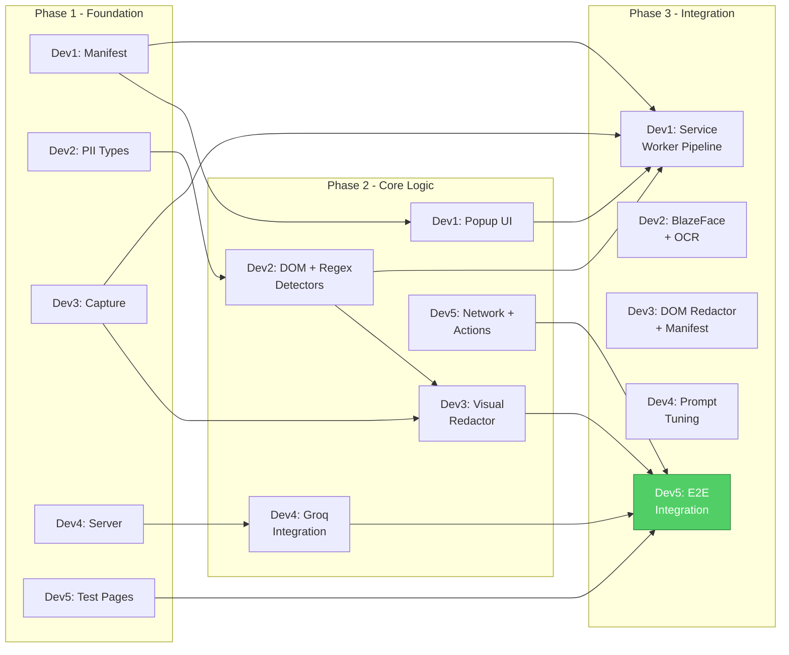

# Veilex — Team Task Division

**5 Developers × 5 Phases ≈ 3 Days**

---

## Developer Roles

| Dev | Role | Owns | Skills Needed |
|---|---|---|---|
| **Dev 1** | 🏗️ Extension Architect | Manifest, service worker, popup UI, orchestration | Chrome Extension APIs, HTML/CSS/JS |
| **Dev 2** | 🔒 Privacy Engineer | All PII detection (Tier 1, 2, 3), hardware profiler | Regex, ONNX Runtime, ML inference |
| **Dev 3** | 🎨 Redaction Engineer | Screen capture, DOM extraction, visual + DOM redaction | Canvas API, DOM manipulation |
| **Dev 4** | ☁️ Server/AI Engineer | FastAPI server, VLM integration, action generator | Python, FastAPI, Groq/LLM APIs |
| **Dev 5** | 🔗 Integration Engineer | Network layer, action execution, test pages, demo | Fetch API, end-to-end testing |

---

## Visual Timeline

```
            Day 1 AM        Day 1 PM        Day 2 AM        Day 2 PM        Day 3 AM        Day 3 PM
           ┌──────────┐    ┌──────────┐    ┌──────────┐    ┌──────────┐    ┌──────────┐    ┌──────────┐
Dev 1      │ Phase 1  │    │ Phase 2  │    │ Phase 3  │    │ Phase 3  │    │ Phase 4  │    │ Phase 5  │
🏗️ Ext.   │ Manifest │    │ Popup UI │    │ Service  │    │ Worker   │    │ Integr.  │    │ Polish   │
Architect  │ + shells │    │ + styles │    │ Worker   │    │ complete │    │ testing  │    │ + bugs   │
           └──────────┘    └──────────┘    └──────────┘    └──────────┘    └──────────┘    └──────────┘
           ┌──────────┐    ┌──────────┐    ┌──────────┐    ┌──────────┐    ┌──────────┐    ┌──────────┐
Dev 2      │ Phase 1  │    │ Phase 2  │    │ Phase 2  │    │ Phase 3  │    │ Phase 4  │    │ Phase 5  │
🔒 Privacy │ PII types│    │ DOM det. │    │ Regex    │    │ BlazeFace│    │ Tier 3 + │    │ Tuning   │
Engineer   │ + enums  │    │ detector │    │ detector │    │ + OCR    │    │ profiler │    │ + edge   │
           └──────────┘    └──────────┘    └──────────┘    └──────────┘    └──────────┘    └──────────┘
           ┌──────────┐    ┌──────────┐    ┌──────────┐    ┌──────────┐    ┌──────────┐    ┌──────────┐
Dev 3      │ Phase 1  │    │ Phase 2  │    │ Phase 2  │    │ Phase 3  │    │ Phase 4  │    │ Phase 5  │
🎨 Redact. │ Capture  │    │ DOM      │    │ Visual   │    │ DOM      │    │ Manifest │    │ Safety   │
Engineer   │ module   │    │ extract  │    │ redactor │    │ redactor │    │ gen.     │    │ margins  │
           └──────────┘    └──────────┘    └──────────┘    └──────────┘    └──────────┘    └──────────┘
           ┌──────────┐    ┌──────────┐    ┌──────────┐    ┌──────────┐    ┌──────────┐    ┌──────────┐
Dev 4      │ Phase 1  │    │ Phase 2  │    │ Phase 2  │    │ Phase 3  │    │ Phase 4  │    │ Phase 5  │
☁️ Server  │ FastAPI  │    │ VLM eng. │    │ Groq     │    │ Action   │    │ System   │    │ Fallback │
AI Eng.    │ + models │    │ skeleton │    │ integr.  │    │ gen.     │    │ prompt   │    │ + tuning │
           └──────────┘    └──────────┘    └──────────┘    └──────────┘    └──────────┘    └──────────┘
           ┌──────────┐    ┌──────────┐    ┌──────────┐    ┌──────────┐    ┌──────────┐    ┌──────────┐
Dev 5      │ Phase 1  │    │ Phase 2  │    │ Phase 2  │    │ Phase 3  │    │ Phase 4  │    │ Phase 5  │
🔗 Integr. │ Test     │    │ API      │    │ Context  │    │ Action   │    │ Full     │    │ Demo     │
Engineer   │ pages    │    │ client   │    │ packager │    │ executor │    │ pipeline │    │ video    │
           └──────────┘    └──────────┘    └──────────┘    └──────────┘    └──────────┘    └──────────┘

                                                          ▲
                                              INTEGRATION CHECKPOINT
                                              (Day 2 PM: first full pipeline test)
```

---

## Phase 1 — Foundation (Day 1 Morning, ~4 hours)

> **Goal:** Every developer has their skeleton files created. Extension loads in Chrome. Server runs. No real logic yet — just the wiring.

### Dev 1 — 🏗️ Extension Architect

| Task | File | Hours | Deliverable |
|---|---|---|---|
| Create Chrome manifest with all permissions, content scripts, service worker, commands | `extension/manifest.json` | 1h | Extension loads in `chrome://extensions` |
| Create Firefox manifest | `extension/manifest-firefox.json` | 0.5h | Firefox compat manifest ready |
| Scaffold popup HTML shell (empty layout) | `extension/popup/popup.html` | 0.5h | Popup opens on icon click |
| Scaffold service worker (just message listener stubs) | `extension/background/service-worker.js` | 1h | SW registers, logs messages |
| Create offscreen document shell | `extension/background/offscreen-worker.html` + `.js` | 0.5h | Offscreen doc creates/destroys |
| Create extension icons (placeholder) | `extension/icons/icon16,48,128.png` | 0.5h | Icons show in toolbar |

**Deliverable:** Extension installs in Chrome, popup opens, service worker runs, keyboard shortcut registered.

---

### Dev 2 — 🔒 Privacy Engineer

| Task | File | Hours | Deliverable |
|---|---|---|---|
| Define PII types enum with all tokens and methods | `extension/privacy/pii-types.js` | 1h | Importable PII_TYPES constant |
| Scaffold dom-detector.js (export function, no logic yet) | `extension/privacy/dom-detector.js` | 0.5h | Function signature ready |
| Scaffold regex-detector.js (export function, no logic yet) | `extension/privacy/regex-detector.js` | 0.5h | Function signature ready |
| Scaffold face-detector.js (export function, no logic yet) | `extension/privacy/face-detector.js` | 0.5h | Function signature ready |
| Research + download BlazeFace ONNX model, test it loads | — | 1.5h | Model file validated |

**Deliverable:** All PII type definitions complete. Detection function signatures defined. BlazeFace model downloaded and verified.

---

### Dev 3 — 🎨 Redaction Engineer

| Task | File | Hours | Deliverable |
|---|---|---|---|
| Implement screen capture module | `extension/capture/screen-capture.js` | 1.5h | `captureTab()` returns data URL |
| Scaffold DOM extractor (content script) | `extension/capture/dom-extractor.js` | 1h | Extracts element list from any page |
| Scaffold visual-redactor.js (canvas setup, no redaction yet) | `extension/redaction/visual-redactor.js` | 1h | Canvas renders a screenshot |
| Scaffold dom-redactor.js (export function) | `extension/redaction/dom-redactor.js` | 0.5h | Function signature ready |

**Deliverable:** Can capture a tab screenshot and render it on an offscreen canvas. DOM extractor returns element list with bounding boxes.

---

### Dev 4 — ☁️ Server/AI Engineer

| Task | File | Hours | Deliverable |
|---|---|---|---|
| Create FastAPI app with CORS, health endpoint | `server/main.py` | 1h | `GET /api/health` returns 200 |
| Define Pydantic request/response models | `server/models.py` | 1h | All schemas typed |
| Create `.env.example` and requirements.txt | `server/.env.example`, `server/requirements.txt` | 0.5h | `pip install` works |
| Scaffold VLM engine (stub that returns mock actions) | `server/vlm_engine.py` | 1h | `/api/analyze` returns mock JSON |
| Scaffold action generator | `server/action_generator.py` | 0.5h | Function signature ready |

**Deliverable:** Server runs on `localhost:8000`. POST to `/api/analyze` returns a mock action response. All Pydantic models defined.

---

### Dev 5 — 🔗 Integration Engineer

| Task | File | Hours | Deliverable |
|---|---|---|---|
| Create demo test page with planted PII | `test/demo-page.html` | 2h | Page with 8+ PII types, ground truth JSON |
| Create clean test page (zero PII) | `test/demo-page-clean.html` | 0.5h | Page that should trigger zero detections |
| Scaffold API client (stub HTTPS POST) | `extension/network/api-client.js` | 0.5h | Function posts to server |
| Scaffold context packager | `extension/network/context-packager.js` | 0.5h | Function signature ready |
| Scaffold action validator + executor stubs | `extension/actions/action-validator.js`, `action-executor.js` | 0.5h | Function signatures ready |

**Deliverable:** Demo pages ready for testing. Network layer stubs compile. Can manually POST to server and get mock response.

---

### 🔄 Phase 1 Sync Checkpoint (Day 1, ~12:30 PM)
- [ ] Extension loads in Chrome without errors
- [ ] Server runs and returns mock responses
- [ ] Demo test page accessible at `file://` or `localhost`
- [ ] All function signatures agreed upon (input/output shapes)

---

## Phase 2 — Core Logic (Day 1 Afternoon + Day 2 Morning, ~8 hours)

> **Goal:** Each module has real working logic. PII detection works. Redaction works. Server talks to Groq. Nothing connected end-to-end yet.

### Dev 1 — 🏗️ Extension Architect

| Task | File | Hours | Deliverable |
|---|---|---|---|
| Build full popup UI with prompt input, status bar, privacy log panel, metrics panel | `extension/popup/popup.html` | 2h | Functional popup UI |
| Style popup: dark theme, glassmorphism, status colors, micro-animations | `extension/popup/popup.css` | 2h | Visually polished popup |
| Wire popup.js to send/receive messages from service worker | `extension/popup/popup.js` | 2h | Popup shows live status updates |
| Add settings panel: server URL, sensitivity level, hardware tier display | `extension/popup/popup.js` | 1h | Settings persist to storage |
| Add privacy log: shows "Redacted: 2 faces, 1 email" per session | `extension/popup/popup.js` | 1h | Log updates after each pipeline run |

**Deliverable:** Fully functional, beautifully styled popup that communicates with service worker.

---

### Dev 2 — 🔒 Privacy Engineer

| Task | File | Hours | Deliverable |
|---|---|---|---|
| Implement DOM detector — analyze input types, autocomplete, labels, name/id patterns | `extension/privacy/dom-detector.js` | 2h | Detects password, email, tel, card fields |
| Implement regex detector — all 8+ patterns with bounding box mapping | `extension/privacy/regex-detector.js` | 3h | Detects email, phone, SSN, CC, Aadhaar, PAN, IP, DOB |
| Add Luhn validation for credit card numbers | `extension/privacy/regex-detector.js` | 0.5h | Reduces CC false positives |
| Write unit tests for all regex patterns (true positives + false positives) | `test/regex-tests.html` | 1.5h | All patterns pass test suite |
| Test Tier 1 against demo-page.html, measure recall | — | 1h | Document: "Tier 1 catches X/Y PII on demo page" |

**Deliverable:** Tier 1 PII detection fully working. All regex patterns tested. Detection works on demo page.

---

### Dev 3 — 🎨 Redaction Engineer

| Task | File | Hours | Deliverable |
|---|---|---|---|
| Complete DOM extractor — full structural snapshot with bbox, labels, types, landmarks | `extension/capture/dom-extractor.js` | 2h | Rich DOM JSON from any page |
| Implement visual redactor — blur faces, black rectangles for text PII, mosaic for documents | `extension/redaction/visual-redactor.js` | 3h | Redacted canvas output |
| Add safety margins (10-15% padding) on all bounding boxes | `extension/redaction/visual-redactor.js` | 0.5h | No partial PII leakage |
| Add redaction token overlays (text labels on redacted regions) | `extension/redaction/visual-redactor.js` | 0.5h | `[FACE]`, `[EMAIL]` labels visible |
| JPEG export at quality 0.80 | `extension/redaction/visual-redactor.js` | 0.5h | Outputs base64 JPEG string |
| Test: manually feed PII regions, verify canvas output | — | 1.5h | Screenshot comparison: before/after |

**Deliverable:** Given a screenshot + PII regions array → outputs a properly redacted JPEG with labels and safety margins.

---

### Dev 4 — ☁️ Server/AI Engineer

| Task | File | Hours | Deliverable |
|---|---|---|---|
| Integrate Groq API — send image + text prompt, get response | `server/vlm_engine.py` | 3h | VLM returns natural language response |
| Design system prompt with redaction awareness | `server/vlm_engine.py` | 1h | VLM understands `[TYPE_REDACTED]` tokens |
| Implement action generator — parse VLM output into structured JSON | `server/action_generator.py` | 2h | Converts NL → `{actions: [...]}` |
| Handle edge cases: VLM returns non-JSON, hallucinated selectors, empty response | `server/action_generator.py` | 1h | Graceful error handling |
| Wire `/api/analyze` endpoint with real VLM + action generator | `server/main.py` | 1h | Full server pipeline works |

**Deliverable:** POST sanitized context to server → Groq processes → returns structured action JSON. Tested with sample payloads.

---

### Dev 5 — 🔗 Integration Engineer

| Task | File | Hours | Deliverable |
|---|---|---|---|
| Implement API client — HTTPS POST with timeout, retry, gzip | `extension/network/api-client.js` | 2h | Posts to server, handles errors |
| Implement context packager — assemble sanitized payload | `extension/network/context-packager.js` | 1.5h | Packages screenshot + DOM + manifest |
| Implement gzip compression via CompressionStream | `extension/network/context-packager.js` | 0.5h | Payload compressed before send |
| Implement action validator — whitelist, security checks, rate limiting | `extension/actions/action-validator.js` | 2h | Blocks malicious actions |
| Implement action executor — click, type, scroll, select, navigate, wait, read, highlight | `extension/actions/action-executor.js` | 2h | Actions execute on DOM with visual overlay |

**Deliverable:** Full network layer works. Actions execute on page with visual feedback. Security validation blocks bad inputs.

---

### 🔄 Phase 2 Sync Checkpoint (Day 2, ~12:30 PM)
- [ ] Tier 1 PII detection works on demo page
- [ ] Visual redaction produces clean output
- [ ] Server returns real actions from Groq
- [ ] Actions execute on a test page
- [ ] Each module tested independently

---

## Phase 3 — Integration (Day 2 Afternoon, ~4 hours)

> **Goal:** Wire everything together. First full pipeline run: prompt → capture → detect → redact → send → action.

### Dev 1 — 🏗️ Extension Architect

| Task | File | Hours | Deliverable |
|---|---|---|---|
| Build the full orchestration pipeline in service worker | `extension/background/service-worker.js` | 3h | Full 10-step pipeline |
| Wire offscreen document: load models, receive screenshots, return detections | `extension/background/offscreen-worker.js` | 1h | Offscreen document hosts ML + canvas |

**Deliverable:** Service worker orchestrates the full loop. Messages flow between all components.

---

### Dev 2 — 🔒 Privacy Engineer

| Task | File | Hours | Deliverable |
|---|---|---|---|
| Implement BlazeFace face detection in offscreen document | `extension/privacy/face-detector.js` | 2.5h | Detects faces, returns bounding boxes |
| Implement OCR detector with Tesseract.js (lazy-loaded) | `extension/privacy/ocr-detector.js` | 1.5h | Extracts text from images → regex scan |

**Deliverable:** Tier 2 detection works. Faces detected in screenshots. OCR extracts text from image regions.

---

### Dev 3 — 🎨 Redaction Engineer

| Task | File | Hours | Deliverable |
|---|---|---|---|
| Implement DOM redactor — replace text with `[TYPE_REDACTED]` tokens | `extension/redaction/dom-redactor.js` | 1.5h | DOM JSON has zero PII |
| Implement redaction manifest generator | `extension/redaction/manifest-generator.js` | 1.5h | JSON manifest with all redaction metadata |
| Test full redaction pipeline: PII regions → visual + DOM + manifest | — | 1h | All 3 outputs verified |

**Deliverable:** Complete redaction pipeline produces sanitized screenshot + clean DOM + manifest.

---

### Dev 4 — ☁️ Server/AI Engineer

| Task | File | Hours | Deliverable |
|---|---|---|---|
| Tune system prompt for multi-step form filling scenario | `server/vlm_engine.py` | 1.5h | VLM produces accurate actions for demo page |
| Add Ollama fallback for local VLM | `server/vlm_engine.py` | 1h | Works without Groq API key |
| Test with real sanitized screenshots from Dev 3 | — | 1.5h | Server produces correct actions for demo page |

**Deliverable:** Server produces correct, executable actions when given real sanitized context from the extension.

---

### Dev 5 — 🔗 Integration Engineer

| Task | File | Hours | Deliverable |
|---|---|---|---|
| Wire action executor as content script receiving messages from service worker | `extension/actions/action-executor.js` | 1h | Actions execute via message passing |
| Implement multi-step flow loop (execute → re-capture → next action) | `extension/actions/action-executor.js` | 1.5h | Agent loops through multiple steps |
| **INTEGRATION TEST: First full pipeline run** | — | 1.5h | Prompt → capture → detect → redact → send → action on demo page |

**Deliverable:** 🎉 First successful end-to-end pipeline run on demo page.

---

### 🔄 Phase 3 Sync Checkpoint (Day 2, ~5:30 PM)
- [ ] ✅ Full pipeline works end-to-end at least once
- [ ] PII detection catches faces + form fields + text patterns
- [ ] Redacted screenshot has zero visible PII
- [ ] Server returns correct action for demo page
- [ ] Action executes on page (e.g., clicks a button)

---

## Phase 4 — Hardening (Day 3 Morning, ~4 hours)

> **Goal:** Fix bugs from integration. Add hardware profiling. Add metrics. Multi-step flows work reliably.

### Dev 1 — 🏗️ Extension Architect

| Task | File | Hours | Deliverable |
|---|---|---|---|
| Add per-stage timing to pipeline, send to popup | `extension/background/service-worker.js` | 1h | Popup shows timing bars |
| Add badge text updates during pipeline (🔍→🛡️→📤→⚡) | `extension/background/service-worker.js` | 0.5h | Badge shows current state |
| Fix all message-passing bugs discovered in Phase 3 | Various | 1.5h | Clean pipeline runs |
| Test keyboard shortcut Ctrl+Shift+V | `extension/manifest.json` | 0.5h | Shortcut triggers pipeline |
| Handle edge cases: no active tab, PDF pages, chrome:// pages | `extension/background/service-worker.js` | 0.5h | Graceful errors |

---

### Dev 2 — 🔒 Privacy Engineer

| Task | File | Hours | Deliverable |
|---|---|---|---|
| Implement hardware profiler with 3-tier auto-detection | `extension/core/hardware-profiler.js` | 2h | Tier assigned on install |
| Implement Tier 3: MobileNet-v2 document classification (if time permits) | `extension/privacy/vision-model.js` | 1.5h | Classifies ID cards, medical forms |
| Tune confidence thresholds to reduce false positives | All detectors | 0.5h | Precision improved |

---

### Dev 3 — 🎨 Redaction Engineer

| Task | File | Hours | Deliverable |
|---|---|---|---|
| Implement manifest summary for popup privacy log | `extension/redaction/manifest-generator.js` | 1h | `{ "FACE": 2, "EMAIL": 3 }` summary |
| Test redaction safety margins — verify no partial PII leaks | `extension/redaction/visual-redactor.js` | 1h | Zero leakage confirmed |
| Handle edge cases: overlapping PII regions, off-screen elements, scrolled content | `extension/redaction/visual-redactor.js` | 1.5h | Robust redaction |
| Optimize canvas operations for speed | `extension/redaction/visual-redactor.js` | 0.5h | Redaction < 200ms |

---

### Dev 4 — ☁️ Server/AI Engineer

| Task | File | Hours | Deliverable |
|---|---|---|---|
| Refine system prompt based on real pipeline outputs from Phase 3 | `server/vlm_engine.py` | 1.5h | Improved action accuracy |
| Add structured JSON output enforcement (few-shot examples in prompt) | `server/vlm_engine.py` | 1h | VLM outputs clean JSON reliably |
| Add request logging and error analytics | `server/main.py` | 1h | Logs for debugging |
| Test all 3 demo scenarios | — | 0.5h | Server handles all scenarios |

---

### Dev 5 — 🔗 Integration Engineer

| Task | File | Hours | Deliverable |
|---|---|---|---|
| Full pipeline stress test — run 10 consecutive prompts | — | 1h | Pipeline reliable under repeat use |
| Test multi-step flow: form filling 5+ steps | — | 1.5h | Agent fills entire form |
| Test action security: send malicious payloads to validator | `extension/actions/action-validator.js` | 0.5h | All bad inputs blocked |
| Measure end-to-end latency, document per-stage breakdown | — | 1h | Latency report |

---

### 🔄 Phase 4 Sync Checkpoint (Day 3, ~12:30 PM)
- [ ] Pipeline runs reliably 10/10 times
- [ ] Hardware tier adapts detection depth
- [ ] Multi-step form filling works
- [ ] Latency < 5s for full pipeline
- [ ] All edge cases handled

---

## Phase 5 — Polish & Demo (Day 3 Afternoon, ~4 hours)

> **Goal:** Demo-ready. Video recorded. README complete. Presentation materials prepared.

### Dev 1 — 🏗️ Extension Architect

| Task | File | Hours | Deliverable |
|---|---|---|---|
| Final popup polish — animations, error states, empty states | `extension/popup/` | 1.5h | Production-quality UI |
| Generate extension icons (proper branded icons) | `extension/icons/` | 0.5h | Professional icons |
| Write extension README section (installation, usage) | `README.md` | 1h | Clear setup instructions |
| Help with demo recording | — | 1h | Support |

---

### Dev 2 — 🔒 Privacy Engineer

| Task | File | Hours | Deliverable |
|---|---|---|---|
| Tune detection thresholds for max recall on demo page | All detectors | 1h | > 95% recall on planted PII |
| Measure precision on clean demo page (false positives) | — | 0.5h | Document: precision score |
| Write privacy detection section of README | `README.md` | 0.5h | Document detection approach |
| Create PII detection accuracy report for judges | `docs/accuracy-report.md` | 1h | Table: PII type, count, detected, missed |
| Help with demo recording | — | 1h | Support |

---

### Dev 3 — 🎨 Redaction Engineer

| Task | File | Hours | Deliverable |
|---|---|---|---|
| Create before/after screenshot comparison for presentation | — | 1h | Visual proof of redaction |
| Final redaction quality check on all PII types | — | 1h | All types redacted cleanly |
| Write redaction section of README | `README.md` | 0.5h | Document redaction approach |
| Help with demo recording | — | 1.5h | Support |

---

### Dev 4 — ☁️ Server/AI Engineer

| Task | File | Hours | Deliverable |
|---|---|---|---|
| Add Ollama/OpenAI fallback chain (for demo reliability) | `server/vlm_engine.py` | 1h | Fallback works if Groq is down |
| Write server README section (setup, API docs) | `README.md` | 1h | API documentation |
| Setup scripts for one-command deploy | `scripts/setup.ps1`, `scripts/setup.sh` | 1h | `./setup.sh` does everything |
| Help with demo recording | — | 1h | Support |

---

### Dev 5 — 🔗 Integration Engineer

| Task | File | Hours | Deliverable |
|---|---|---|---|
| **Record demo video** — full signup form scenario, narrated | — | 2h | 3-5 minute demo video |
| Write demo scenarios doc | `docs/demo-scenarios.md` | 0.5h | 3 documented scenarios |
| Final end-to-end test on fresh Chrome profile | — | 1h | Works from scratch |
| Write project summary for judges | `README.md` | 0.5h | Compelling project intro |

---

### 🔄 Phase 5 Final Checkpoint (Day 3, ~5:00 PM)
- [x] ✅ Demo video recorded (form filling end-to-end) (Ready for manual recording)
- [x] ✅ README complete (setup, usage, architecture, evaluation)
- [x] ✅ Extension installs and works on fresh Chrome
- [x] ✅ Server deploys and responds
- [x] ✅ Before/after screenshots saved
- [x] ✅ Accuracy report for judges
- [x] ✅ Code pushed to GitHub

---

## Dependency Map



**Key dependency:** Dev 5's integration test (Phase 3) depends on outputs from all other devs. This is the **critical path**.

---

## Communication Protocol

| When | What | Who |
|---|---|---|
| **Day start** (9:00 AM) | 15-min standup: blockers + today's goal | All 5 devs |
| **Phase checkpoint** | 10-min sync: "does my output work with yours?" | All 5 devs |
| **Async** | Share function signatures + sample data formats via team chat | As needed |
| **Blocker** | Immediately message the person you're blocked on + team lead | Affected devs |

## Git Workflow

```
main ← protected, merge only after phase checkpoint
  ├── dev1/extension-core
  ├── dev2/privacy-detection
  ├── dev3/redaction-engine
  ├── dev4/server
  └── dev5/integration-testing

Merge order per phase: Dev4 → Dev2 → Dev3 → Dev1 → Dev5
(Server first, then detection, then redaction, then orchestration, then integration)
```
